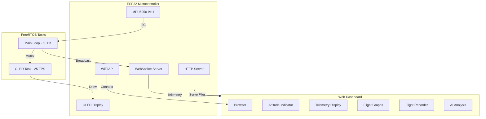
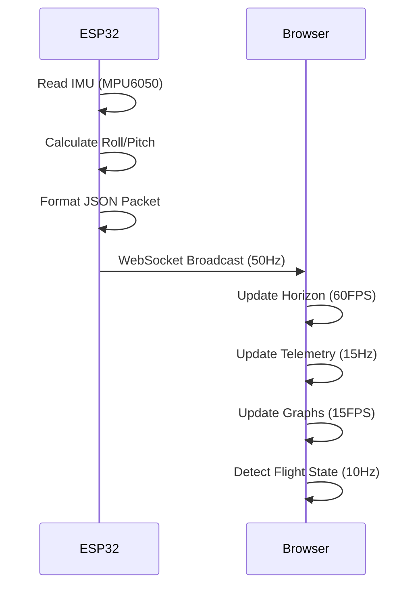
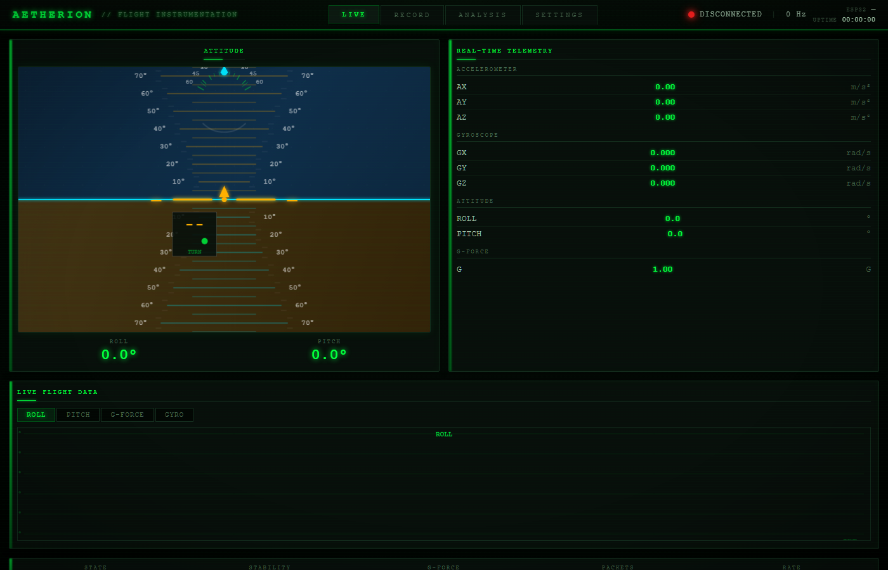
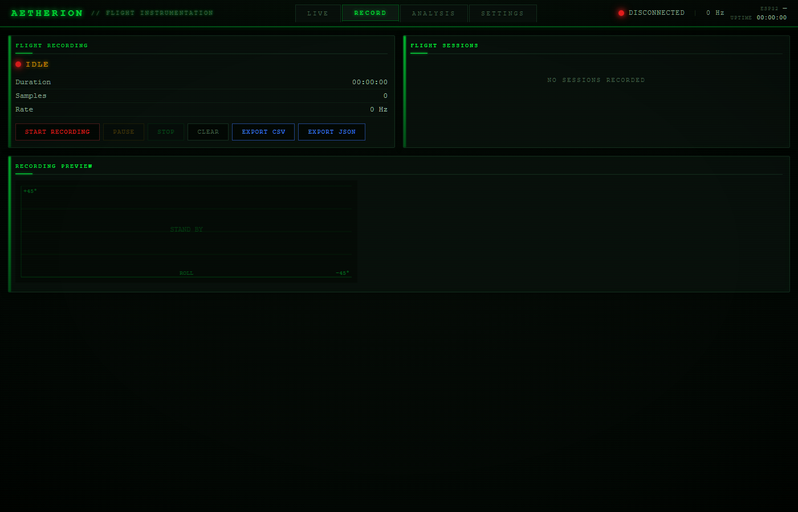
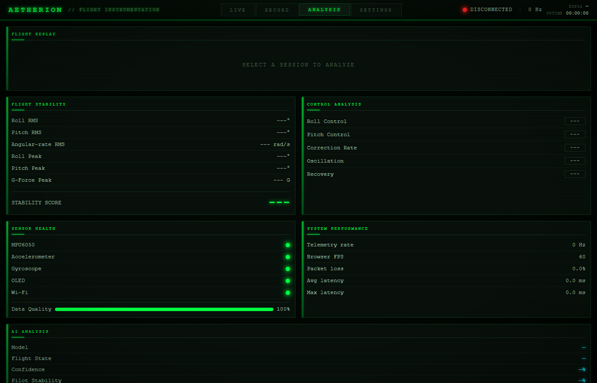
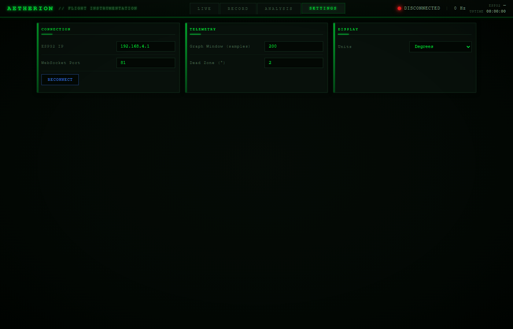
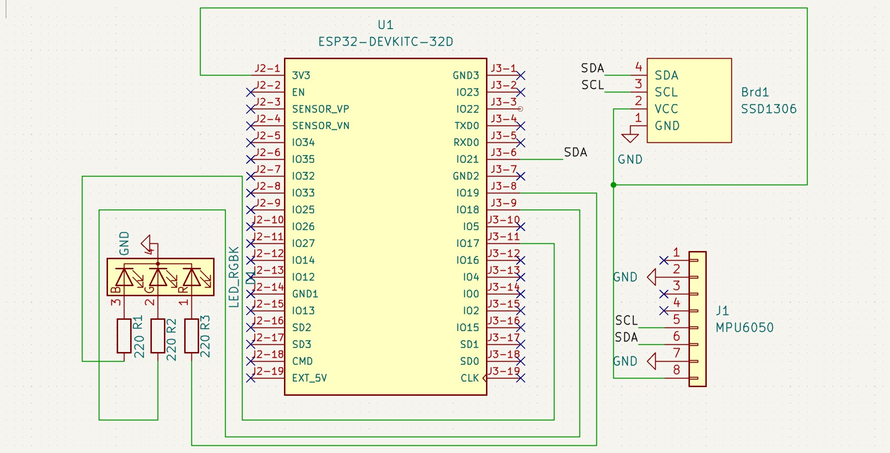
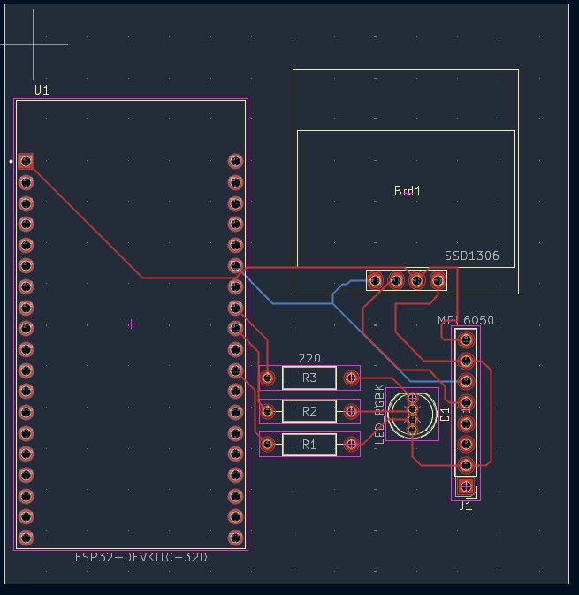
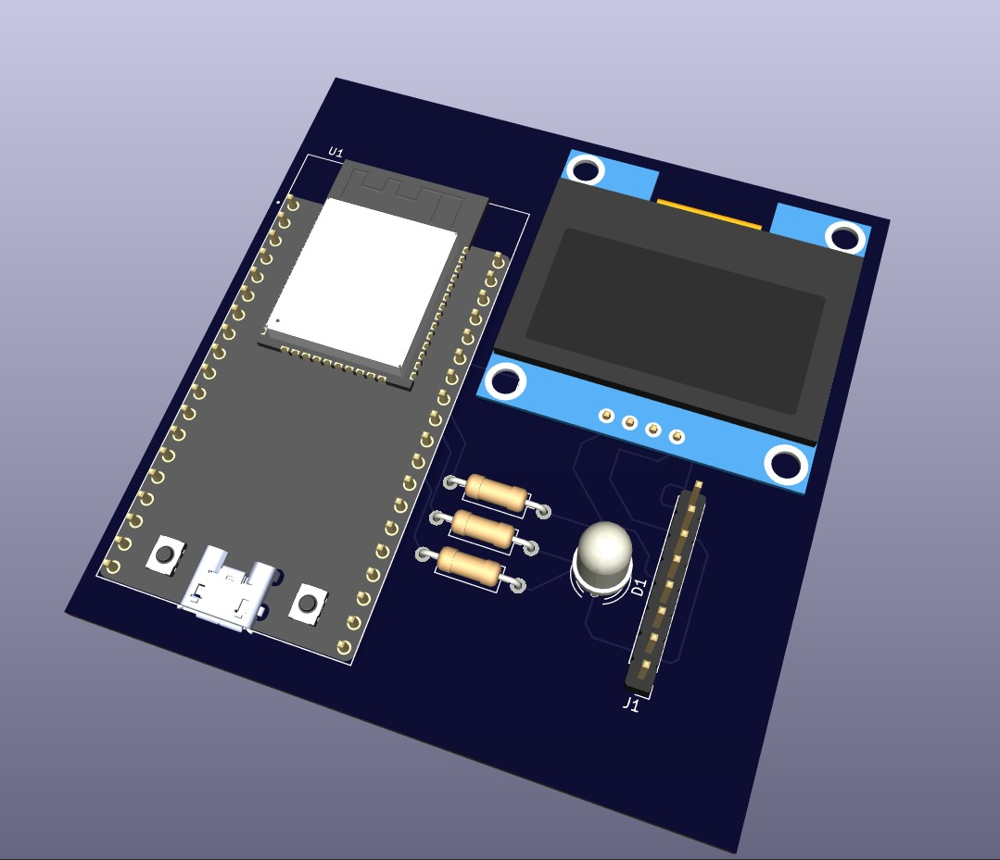

# AETHERION AI

An ESP32-based attitude indicator with wireless OLED dashboard for real-time flight instrumentation.

## System Architecture



## Data Flow



## Project Structure

```
Aetherion/
├── firmware/           # ESP32 Arduino firmware
│   └── Aetherion/
│       ├── Aetherion.ino    # Main sketch
│       ├── config.h         # Configuration
│       ├── imu.cpp/h        # IMU sensor driver
│       ├── graphics.cpp/h   # OLED display rendering
│       ├── web.cpp/h        # HTTP/WebSocket server
│       ├── rgb.cpp/h        # RGB LED control
│       └── data/            # Dashboard files (LittleFS)
├── dashboard/          # Web-based wireless OLED dashboard
│   ├── index.html           # Dashboard UI
│   ├── style.css            # Styles
│   └── js/
│       ├── app.js           # Core application
│       ├── horizon.js       # Attitude indicator
│       ├── graphs.js        # Live flight graphs
│       ├── flight-state.js  # Flight state detection
│       ├── recorder.js      # Flight recording
│       ├── analysis.js      # AI analysis
│       └── settings.js      # Configuration
├── pcb/                # KiCad PCB design files
├── screenshots/        # Project screenshots
└── docs/               # Documentation
```

## Firmware Features

- **IMU Sensing**: MPU6050 accelerometer + gyroscope
- **OLED Display**: 128x64 Primary Flight Display at 25 FPS
- **WiFi Access Point**: Creates its own network (`Aetherion` / `aetherion123`)
- **WebSocket Telemetry**: 50 Hz broadcast of roll, pitch, G-force, and raw sensor data
- **HTTP Web Server**: Serves dashboard from LittleFS
- **FreeRTOS**: Separate OLED task with I2C mutex for non-blocking operation
- **RGB LED Status**: Visual boot/ready/error indicators

## Dashboard Features

- **Live Attitude Indicator**: Real-time horizon display at 60 FPS
- **Telemetry Panel**: Accelerometer, gyroscope, and attitude readouts
- **Flight Graphs**: Roll, pitch, G-force, and gyro data visualization
- **Flight Recording**: Record, pause, stop, and export sessions (CSV/JSON)
- **Flight Replay**: Analyze recorded flights with playback controls
- **Stability Analysis**: RMS calculations and stability scoring
- **AI Analysis**: Machine learning models (Random Forest, XGBoost, Neural Network, SVM)
- **Sensor Health**: Real-time system diagnostics

### Dashboard Screenshots

**Live Tab** - Real-time attitude indicator and telemetry:



**Record Tab** - Flight recording and session management:



**Analysis Tab** - Flight replay, stability analysis, and AI diagnostics:



**Settings Tab** - Connection and display configuration:



## PCB Design

KiCad project files for the Aetherion hardware:







## Hardware

| Component | Specification |
|-----------|--------------|
| MCU | ESP32 DevKit |
| IMU | MPU6050 (I2C, 400kHz) |
| Display | 0.96" OLED 128x64 (I2C) |
| RGB LED | Common Cathode |
| WiFi | 802.11 b/g/n (AP Mode) |

## Quick Start

1. **Flash Firmware**: Open `firmware/Aetherion/Aetherion.ino` in Arduino IDE and upload
2. **Connect WiFi**: Join `Aetherion` network from any device
3. **Open Dashboard**: Navigate to `http://192.168.4.1` in your browser

## License

MIT License - see [LICENSE](LICENSE)
