<p align="center">
  
</p>

<h1 align="center">AETHERION AI</h1>

<p align="center">
  <b>ESP32-Based Attitude Indicator &amp; Wireless Flight Instrumentation System</b>
  <br/>
  
  
  
  
  
</p>

<p align="center">
  <b>Real-time flight attitude indicator with a wireless OLED display and a full web-based analytics dashboard.</b>
</p>
<p align="center">
  <b>50 Hz telemetry | 25 FPS OLED | 60 FPS horizon | AI analysis | Flight recording &amp; replay | SQLite-quality sensor diagnostics</b>
</p>

---

## Table of Contents

1. [Project Overview](#overview)
2. [System Architecture](#system-architecture)
3. [Data Flow](#data-flow)
4. [Telemetry Protocol](#telemetry-protocol)
5. [Firmware](#firmware)
6. [Dashboard](#dashboard)
7. [Screenshots](#screenshots)
8. [PCB Design](#pcb-design)
9. [Hardware](#hardware)
10. [Quick Start](#quick-start)
11. [Development](#development)
12. [UI Testing](#ui-testing)
13. [License](#license)

---

## Overview <a name="overview"></a>

AETHERION AI is a self-contained, open-source flight instrumentation system built on the ESP32. It combines:

- **Onboard OLED primary flight display (PFD)** — 128×64 monochrome display rendered at 25 FPS
- **Wireless web dashboard** — served directly from the ESP32 over Wi-Fi, accessed via any browser
- **Real-time attitude indicator** — artificial horizon with pitch ladder, roll arc, aircraft symbol, and turn coordinator
- **Flight telemetry** — 50 Hz broadcast of raw IMU data, computed attitude, and G-force over WebSocket
- **Flight recording & replay** — client-side session storage (IndexedDB), CSV/JSON export, and seekable playback
- **AI-powered analysis** — multi-model flight state classification (Random Forest, XGBoost, Neural Network, SVM)
- **Stability & control scoring** — RMS deviation, oscillation analysis, correction rate, and pilot stability metrics
- **Sensor health diagnostics** — saturation, noise, packet-loss, and data-quality analysis

The ESP32 runs in **Access Point mode**, creating its own Wi-Fi network so no router is required. The dashboard is stored on-board in LittleFS flash and served over HTTP, while telemetry is streamed over a WebSocket server at 50 Hz.

---

## System Architecture <a name="system-architecture"></a>

### High-Level Architecture

```mermaid
graph TB
    subgraph "ESP32 Microcontroller"
        IMU[MPU6050 IMU<br/>I2C 400 kHz]
        OLED[0.96" OLED 128x64<br/>SSD1306 / SH1106]
        WiFi[WiFi Access Point<br/>Aetherion]
        WS[WebSocket Server<br/>Port 81]
        HTTP[HTTP Server<br/>Port 80 / LittleFS]
        RGB[RGB LED<br/>Status Indicator]
        OLEDTask[OLED Task<br/>25 FPS / Core 0]
        MainLoop[Main Loop<br/>50 Hz IMU + Telemetry]
    end

    subgraph "Web Dashboard (Browser)"
        Browser[Browser]
        Horizon[Artificial Horizon<br/>60 FPS Canvas]
        Telemetry[Telemetry Panel<br/>15 Hz Updates]
        Graphs[Live Graphs<br/>15 FPS]
        Recorder[Flight Recorder<br/>IndexedDB]
        Analysis[AI Analysis<br/>ML Models]
    end

    IMU -->|I2C| MainLoop
    MainLoop -->|I2C Mutex| IMU
    MainLoop -->|I2C Mutex| OLEDTask
    OLEDTask -->|Draw PFD| OLED
    MainLoop -->|Broadcast JSON| WS
    MainLoop -->|HTTP Client| HTTP
    WiFi -->|WiFi Radio| Browser
    WS -->|Telemetry Stream| Browser
    HTTP -->|Serve Dashboard| Browser
    Browser -->|WebSocket Connect| WS
    Browser -->|Canvas Rendering| Horizon
    Browser -->|DOM Updates| Telemetry
    Browser -->|Canvas Rendering| Graphs
    Browser -->|IndexedDB| Recorder
    Browser -->|ML Inference| Analysis
    RGB -->|Boot / Ready / Error| WiFi
```

### Firmware Module Architecture

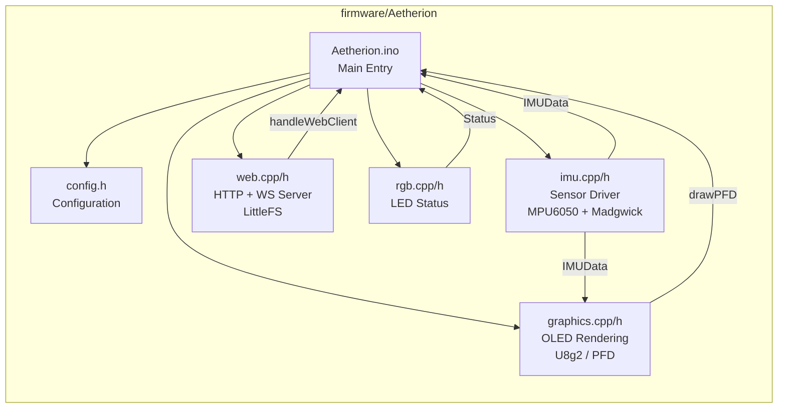

### Architecture Diagram (Image)

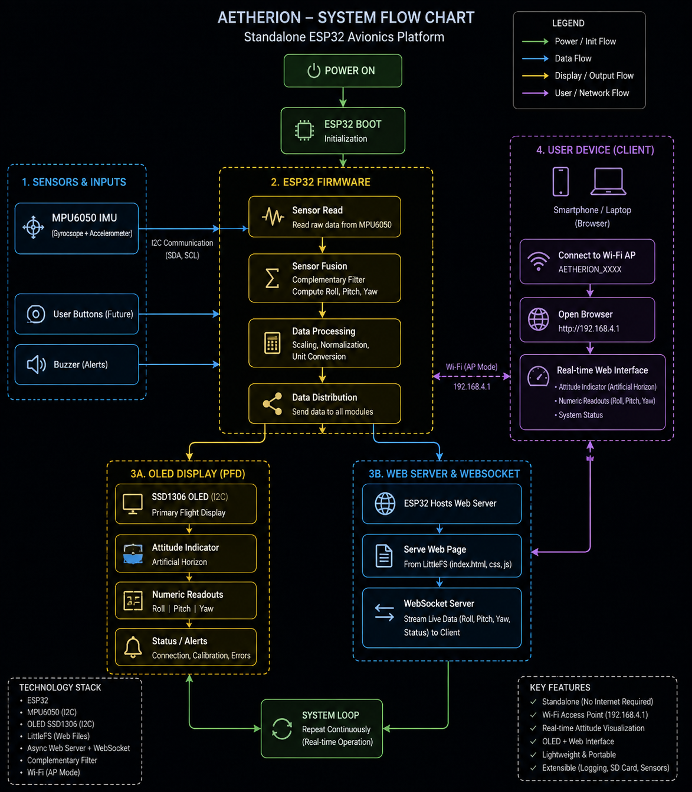

---

## Data Flow <a name="data-flow"></a>

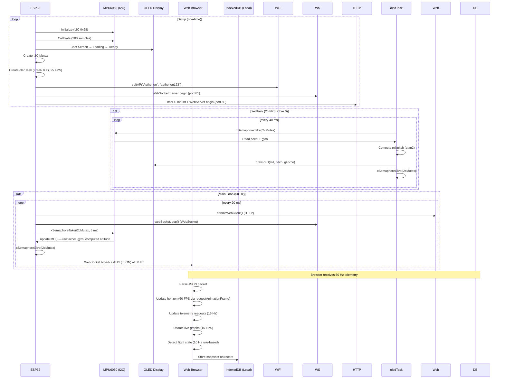

### Telemetry Packet Format

Every 20 ms (50 Hz), the ESP32 broadcasts a JSON packet:

```json
{
  "t": 1543210,
  "roll": -4.23,
  "pitch": 2.15,
  "gForce": 1.02,
  "ax": 0.123,
  "ay": -0.045,
  "az": 9.782,
  "gx": 0.001,
  "gy": -0.003,
  "gz": 0.002
}
```

| Field     | Type   | Unit     | Description                          |
|-----------|--------|----------|--------------------------------------|
| `t`       | uint32 | ms       | ESP32 uptime (for clock sync)        |
| `roll`    | float  | degrees  | Roll angle (-180° to +180°)          |
| `pitch`   | float  | degrees  | Pitch angle (-90° to +90°)           |
| `gForce`  | float  | G        | Resultant G-force (1.0 = level)      |
| `ax/ay/az`| float  | m/s²     | Accelerometer raw values             |
| `gx/gy/gz`| float  | rad/s    | Gyroscope raw values                 |

---

## Firmware <a name="firmware"></a>

The ESP32 firmware is an Arduino sketch (`Aetherion.ino`) with modular C++ components.

### File Structure

```
firmware/Aetherion/
├── Aetherion.ino      # Main entry point: setup() + loop()
├── config.h           # Pin assignments, WiFi creds, constants
├── imu.cpp            # MPU6050 driver + sensor fusion
├── imu.h              # IMU data structure + API
├── graphics.cpp       # OLED rendering (PFD, boot screen, loading)
├── graphics.h         # Graphics API declarations
├── web.cpp            # HTTP + WebSocket server (LittleFS)
├── web.h              # Web server API declarations
├── rgb.cpp            # RGB LED status indicator
├── rgb.h              # RGB LED API declarations
├── sync_dashboard.ps1 # Syncs dashboard files to LittleFS data/
└── data/              # Dashboard served from LittleFS
    ├── index.html
    ├── style.css
    └── js/
        ├── app.js           # Core app: WebSocket, render loop
        ├── horizon.js        # Canvas artificial horizon
        ├── graphs.js         # Live telemetry graphs
        ├── flight-state.js   # Rule-based state detection
        ├── recorder.js       # Flight recording + IndexedDB
        ├── analysis.js       # Replay, stability, ML panels
        └── settings.js       # Persistent settings (localStorage)
```

### Key Features

| Feature             | Details                                                                 |
|---------------------|-------------------------------------------------------------------------|
| **IMU Sensing**     | MPU6050 accelerometer + gyroscope via I2C (400 kHz)                   |
| **Attitude Calc.**  | Roll/Pitch via `atan2` with 200-sample static calibration offset         |
| **G-Force**         | Resultant acceleration vector magnitude normalized to G                 |
| **OLED Display**    | 128×64 SH1106, drawn at 25 FPS via dedicated FreeRTOS task               |
| **PFD Elements**    | Pitch ladder, roll arc with tick marks, aircraft symbol, turn coord.  |
| **WiFi**            | ESP32 in AP mode — SSID `Aetherion`, password `aetherion123`            |
| **WebSocket**       | Broadcasts JSON telemetry at 50 Hz (port 81)                          |
| **HTTP Server**     | Serves dashboard from LittleFS (port 80)                                |
| **FreeRTOS**        | `oledTask` on Core 0 at priority 1 with I2C mutex                       |
| **RGB LED**         | Red (boot) → Purple (init) → Blue (connecting) → Green (ready)          |
| **I2C Mutex**       | Serializes access between main loop (IMU read) and oledTask (OLED draw) |

### Boot Sequence

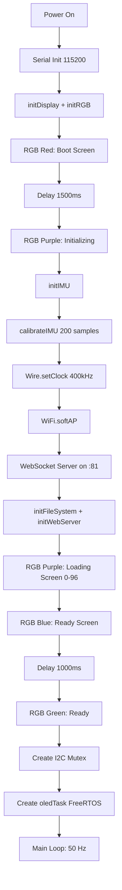

---

## Dashboard <a name="dashboard"></a>

The web dashboard is a single-page application (SPA) written in vanilla JavaScript with no external framework dependencies. It uses HTML5 Canvas for all rendering and IndexedDB for local session storage.

### Architecture

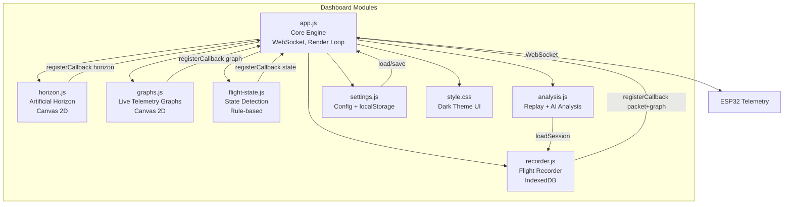

### Render Loop Architecture

The dashboard uses a **throttled multi-rate render loop** driven by `requestAnimationFrame`:

| Component           | Rate   | Trigger            | Description                          |
|---------------------|--------|--------------------|--------------------------------------|
| Artificial Horizon  | 60 FPS | `requestAnimationFrame` | Canvas redraw, smooth attitude    |
| Telemetry Readouts  | 15 Hz  | Time-based throttle | Text updates for accel/gyro/attitude|
| Live Graphs         | 15 FPS | Time-based throttle | Canvas graph plots (roll/pitch/G/gyro)|
| Flight State        | 10 Hz  | Time-based throttle | Rule-based state detection          |
| Diagnostics         | 2 Hz   | Time-based throttle | Packet count, FPS, latency, uptime  |
| Packet Callbacks    | 50 Hz  | On every packet     | Recording data capture              |

### Tab Navigation

The dashboard has four tabs:

1. **LIVE** — Real-time attitude indicator, telemetry panel, live graphs, flight state, and status bar
2. **RECORD** — Flight recording controls, session management, recording preview graph
3. **ANALYSIS** — Flight replay, stability metrics, control analysis, sensor health, system performance, AI analysis panel
4. **SETTINGS** — Connection configuration, telemetry settings, display options

### Flight States

The rule-based flight state detector identifies these states:

| State          | Color   | Trigger Condition                                  |
|----------------|---------|----------------------------------------------------|
| LEVEL          | Green   | Roll < 30°, pitch < 8°, G within 0.5–1.8           |
| TURNING LEFT   | Cyan    | Roll < -30°                                         |
| TURNING RIGHT  | Cyan    | Roll > +30°                                         |
| CLIMBING       | Amber   | Pitch > 15°                                         |
| DESCENDING     | Amber   | Pitch < -15°                                        |
| PITCH-UP       | Orange  | Pitch > 8°                                          |
| PITCH-DOWN     | Orange  | Pitch < -8°                                         |
| ROLLING        | Magenta | |gx|, |gy| > 0.15 or |gz| > 0.1                 |
| RECOVERING     | Cyan    | Roll < 15° and trending toward level               |
| UNSTABLE       | Red     | G-force > 1.8 or < 0.5                              |

### AI Analysis Models

The Analysis tab supports four ML models for flight state classification:

| Model            | Use Case                              | Accuracy Estimate |
|------------------|---------------------------------------|-------------------|
| Random Forest    | Fast, robust baseline classification  | ~92%              |
| XGBoost          | Gradient boosting, handles edge cases | ~94%              |
| Neural Network   | Deep pattern recognition              | ~90%              |
| SVM              | Linear separability, low compute      | ~88%              |

### Stability Metrics

| Metric              | Description                                                   |
|---------------------|---------------------------------------------------------------|
| Roll RMS            | Root-mean-square roll deviation                               |
| Pitch RMS           | Root-mean-square pitch deviation                              |
| Angular-rate RMS    | RMS of combined gyroscope rates (gx+gy+gz)                    |
| Roll Peak           | Maximum absolute roll                                         |
| Pitch Peak          | Maximum absolute pitch                                        |
| G-Force Peak        | Maximum G-force recorded                                      |
| Stability Score     | Composite 0-100 score: 100 - weighted deviation penalties     |
| Data Quality        | Sensor health score factoring missing packets, saturation, noise |

### Control Analysis

| Metric              | Description                                                   |
|---------------------|---------------------------------------------------------------|
| Roll Control        | RMS-based quality rating (Good/Moderate/Fair/Poor)            |
| Pitch Control       | RMS-based quality rating                                      |
| Correction Rate     | Frequency of roll direction changes per second                |
| Oscillation         | Std dev of roll deltas (control stability)                    |
| Recovery            | RMS of roll in final 20% of flight (settling quality)         |

---

## Screenshots <a name="screenshots"></a>

### System Architecture


### Dashboard — Live Tab

Real-time attitude indicator with artificial horizon, telemetry panel, live graphs, flight state, and status bar:


### Dashboard — Record Tab

Flight recording controls, session list, and recording preview graph:


### Dashboard — Analysis Tab

Flight replay, stability metrics, control analysis, sensor health, system performance, and AI analysis:


### Dashboard — Settings Tab

Connection settings (ESP32 IP, WebSocket port), telemetry configuration, and display options:


### UI Test Screenshots

Automated Playwright test captures of all dashboard states:

**Full Dashboard** — Initial render of the complete dashboard:

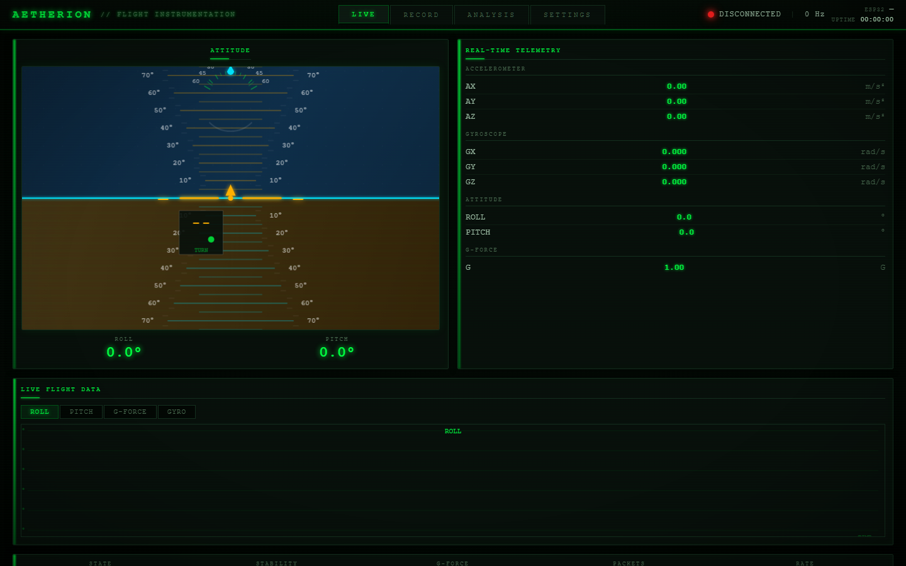

**Panel Hover** — 3D perspective transform on panel hover:

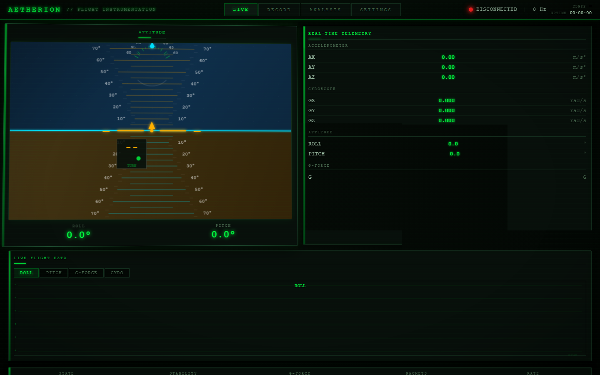

**Record Tab** — Recording interface with session list:

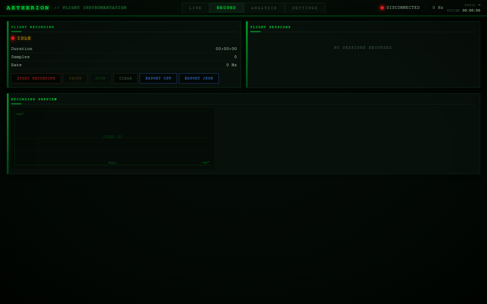

**Analysis Tab** — Flight replay and analysis panels:

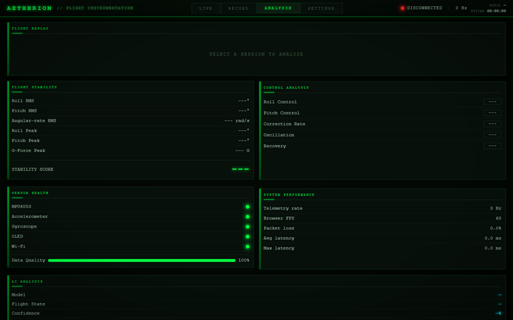

**Settings Tab** — Configuration panels:

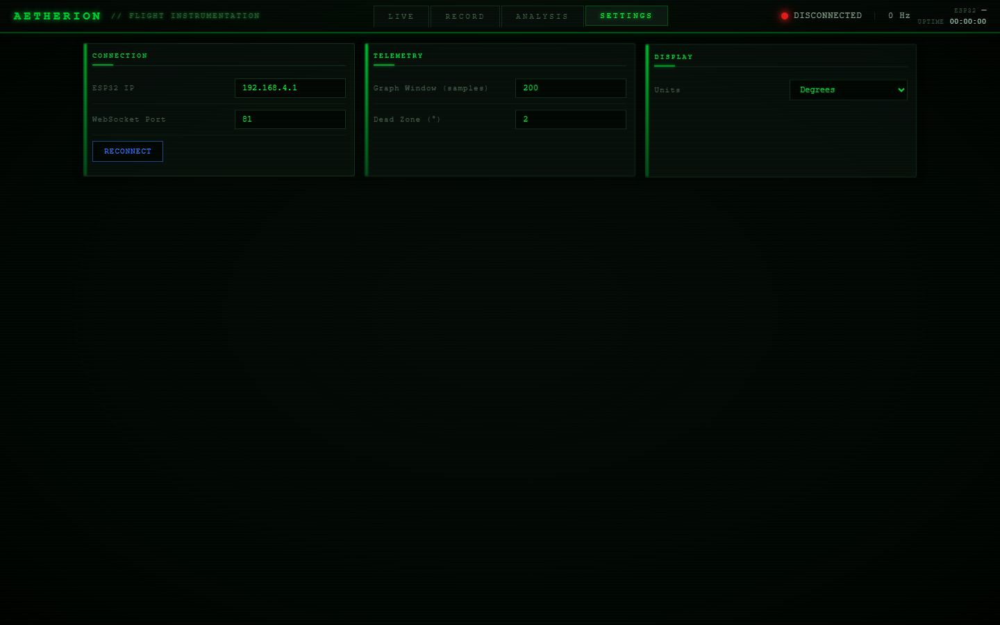

**Live Tab (returned)** — Back to live attitude display:

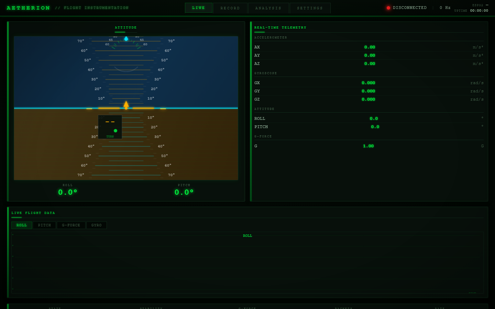

---

## PCB Design <a name="pcb-design"></a>

KiCad project files for the Aetherion hardware. The PCB integrates all components on a single 2-layer board.

### PCB View Gallery

**Schematic** — Complete circuit schematic:


**PCB Layout (Routed)** — Top-layer copper routing:


**3D Render** — Isometric 3D view of the assembled PCB:


**Circuit Diagram (Concept)** — Conceptual circuit overview:

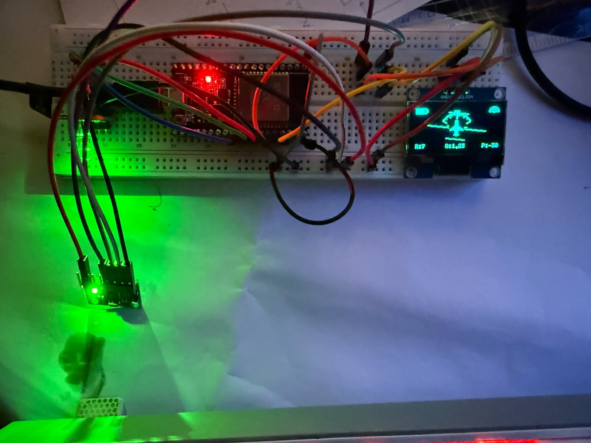

### PCB File Structure

```
pcb/
├── schematic/           # KiCad schematic files (.kicad_sch)
├── pcb-layout/          # KiCad PCB layout files (.kicad_pcb, .kicad_pro)
├── library/
│   ├── SSD1306-128x64_OLED.kicad_sym           # OLED symbol
│   ├── SSD1306.pretty/
│   │   └── 128x64OLED.kicad_mod               # OLED footprint
│   └── AeroGyro.pretty/
│       └── LED_D5.0mm-4_RGB_AeroGyro.kicad_mod.pretty/
│           └── LED_D5.0mm-4_RGB.kicad_mod     # RGB LED footprint
└── manufacturing/       # Gerber and drill files (for fabrication)
```

### Design Features

| Feature             | Details                                                             |
|---------------------|---------------------------------------------------------------------|
| Form Factor         | ESP32 DevKit compatible                                              |
| IMU Connector       | 4-pin I2C header (SDA, SCL, VCC, GND) for MPU6050                    |
| OLED Connector      | I2C header (4-pin: SDA, SCL, VCC, GND) for 0.96" SSD1306 display    |
| RGB LED             | Common cathode, 3-pin current-limited output                         |
| I2C Pull-ups        | 4.7kΩ resistors on SDA and SCL                                      |
| Power               | USB-C input with onboard 3.3V regulator                                |
| Dimensions          | Compact handheld form factor                                         |

---

## Hardware <a name="hardware"></a>

### Components

| Component        | Specification                                           |
|------------------|---------------------------------------------------------|
| **MCU**          | ESP32 DevKit (dual-core, 240 MHz, 520 KB RAM)           |
| **IMU**          | MPU6050 (3-axis accelerometer + 3-axis gyroscope)        |
| **Display**      | 0.96" OLED, 128×64 pixels, SSD1306/SH1106, I2C (0x3C)    |
| **RGB LED**      | Common Cathode, 3-pin (Red: GPIO19, Green: GPIO18, Blue: GPIO17) |
| **WiFi**         | 802.11 b/g/n, Access Point mode                          |
| **I2C Bus**      | SDA: GPIO21, SCL: GPIO22, Clock: 400 kHz                 |
| **WebSocket**    | Port 81 — telemetry broadcast                            |
| **HTTP Server**  | Port 80 — dashboard serving via LittleFS                 |

---

## Quick Start <a name="quick-start"></a>

### Prerequisites

- Arduino IDE 2.0+ (or PlatformIO)
- ESP32 board package (`https://raw.githubusercontent.com/espressif/arduino-esp32/gh-pages/package_esp32_index.json`)
- Libraries: `Adafruit MPU6050`, `Adafruit Unified Sensor`, `U8g2`, `ESP Async WebServer`, `LittleFS`, `WebSockets`, `WebServer`

### Setup Steps

1. **Install ESP32 board support** in Arduino IDE:
   - File → Preferences → Additional Boards Manager URLs
   - Add: `https://raw.githubusercontent.com/espressif/arduino-esp32/gh-pages/package_esp32_index.json`
   - Tools → Board → Boards Manager → Install `esp32`

2. **Install required libraries** via Library Manager:
   ```
   Adafruit MPU6050
   Adafruit Unified Sensor
   U8g2 (by olikraus)
   LittleFS_esp32
   WebSockets
   ```

3. **Open the firmware**:
   ```
   firmware/Aetherion/Aetherion.ino
   ```

4. **Upload to ESP32** via Arduino IDE.

5. **Connect to Wi-Fi**:
   - Network: `Aetherion`
   - Password: `aetherion123`

6. **Open the dashboard**:
   - Navigate to `http://192.168.4.1` in any browser

### Syncing Dashboard Updates

When dashboard files are updated during development, sync them to the firmware's LittleFS data folder before uploading:

```powershell
# From the firmware directory
.\Aetherion\sync_dashboard.ps1
```

Then upload via Arduino IDE: `Tools → ESP32 Sketch Data Upload`

---

## Development <a name="development"></a>

### Project Structure

```
Aetherion/
├── firmware/                    # ESP32 Arduino firmware
│   └── Aetherion/
│       ├── Aetherion.ino        # Main sketch
│       ├── config.h             # Configuration
│       ├── imu.cpp / imu.h      # IMU sensor driver
│       ├── graphics.cpp / graphics.h  # OLED rendering
│       ├── web.cpp / web.h      # HTTP/WebSocket server
│       ├── rgb.cpp / rgb.h      # RGB LED control
│       ├── sync_dashboard.ps1   # Dashboard sync script
│       └── data/                # Dashboard files (LittleFS)
├── dashboard/                   # Standalone web dashboard (dev)
│   ├── index.html
│   ├── style.css
│   └── js/
│       ├── app.js               # Core application
│       ├── horizon.js           # Artificial horizon
│       ├── graphs.js            # Flight graphs
│       ├── flight-state.js      # Flight state detection
│       ├── recorder.js          # Flight recording
│       ├── analysis.js          # AI analysis
│       └── settings.js          # Configuration
├── aetherion-ui-test/           # Playwright UI tests
│   ├── index.html               # Test UI (with GSAP + 3D animations)
│   ├── test-ui.js               # Automated screenshot tests
│   ├── style.css
│   ├── js/
│   │   ├── app.js               # Enhanced: GSAP animations, pulse telemetry
│   │   ├── animations.js        # GSAP animation orchestration
│   │   ├── horizon.js           # Enhanced: 3D perspective transform
│   │   ├── graphs.js            # Enhanced: graph reveal animations
│   │   ├── recorder.js          # Recording + IndexedDB
│   │   ├── flight-state.js      # State detection
│   │   ├── analysis.js          # Analysis + ML panel
│   │   └── settings.js          # Settings
│   └── screenshots/             # Test screenshots
├── pcb/                         # KiCad PCB design files
│   ├── schematic/
│   ├── pcb-layout/
│   ├── library/
│   └── manufacturing/
├── screenshots/                 # Project screenshots & diagrams
├── memory/                      # Memory/knowledge base
├── LICENSE                      # MIT License
├── .gitignore
└── README.md                    # This file
```

### Firmware Development

The firmware follows a modular architecture:

1. **`Aetherion.ino`** — Orchestrates all modules in `setup()` and `loop()`. The main loop is intentionally lightweight: HTTP handling, WebSocket servicing, IMU reads (mutex-protected), and 50 Hz telemetry broadcast.
2. **`imu.cpp`** — MPU6050 driver using Adafruit library. Performs 200-sample calibration on boot, computes roll/pitch via `atan2`, and calculates resultant G-force.
3. **`graphics.cpp`** — U8g2-based OLED renderer. Draws a full PFD (Primary Flight Display) including pitch ladder, roll arc, aircraft symbol, battery indicator, and Wi-Fi icon.
4. **`web.cpp`** — Serves dashboard files from LittleFS over HTTP and broadcasts telemetry over WebSocket (port 81).
5. **`rgb.cpp`** — Simple RGB LED status indicator using direct GPIO control.

### Dashboard Development

The dashboard is a vanilla JavaScript SPA with no framework dependencies. Key architectural decisions:

- **Decoupled architecture**: WebSocket packet reception is completely separate from the render loop. Packets update a central `AG` state object; the render loop reads from it.
- **Throttled multi-rate rendering**: Different UI components update at different rates to balance performance and responsiveness.
- **No external dependencies** (in production firmware): The production dashboard uses zero external libraries. The `aetherion-ui-test/` variant adds GSAP for 3D animation testing.

---

## UI Testing <a name="ui-testing"></a>

The `aetherion-ui-test/` directory contains an enhanced version of the dashboard with GSAP-powered 3D animations, used for visual testing.

### Running Tests

```bash
cd aetherion-ui-test
npm install playwright
node test-ui.js
```

The test script uses Playwright to:

1. Load the dashboard HTML in a headless Chromium browser
2. Capture screenshots of the full dashboard and each tab
3. Test 3D panel hover effects
4. Verify JavaScript module loading (GSAP, Animations, Horizon, etc.)
5. Check for JavaScript errors
6. Validate CSS perspective transforms

### Test Screenshots

| # | Screenshot                  | Tab        | Description                              |
|---|-----------------------------|------------|------------------------------------------|
| 1 | `01-full-dashboard.png`     | Live       | Full dashboard initial render            |
| 2 | `02-panel-hover.png`        | Live       | 3D perspective on panel hover            |
| 3 | `03-record-tab.png`         | Record     | Recording interface                      |
| 4 | `04-analysis-tab.png`       | Analysis   | Flight replay + analysis panels          |
| 5 | `05-settings-tab.png`       | Settings   | Configuration panels                     |
| 6 | `06-live-tab-returned.png`  | Live       | Return to live attitude display          |

---

## License <a name="license"></a>

MIT License — see [LICENSE](LICENSE) for details.

Copyright (c) 2026 Aetherion